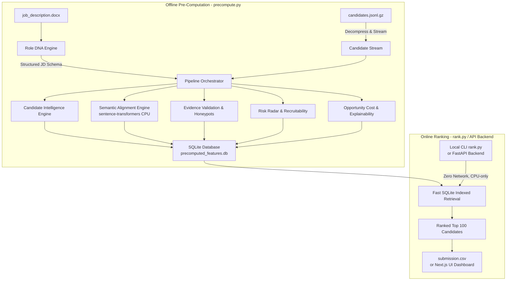
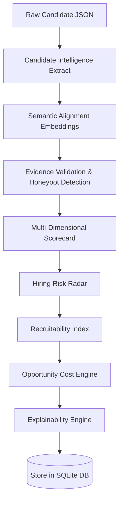

<p align="center">
  <font size="6">Hiring Intelligence Engine (HIE)</font>
</p>

[](https://www.python.org/)
[](https://fastapi.tiangolo.com)
[](https://nextjs.org/)
[](https://sqlite.org/)
[](https://ai.google.dev/)
[](LICENSE)

An enterprise-grade, **evidence-driven, explainable, and multi-dimensional candidate evaluation and ranking platform**. Officially built as a flagship entry for the *Redrob Intelligent Candidate Discovery & Ranking Challenge*.

Traditional Applicant Tracking Systems (ATS) rely on simple keyword-matching. The Hiring Intelligence Engine replaces this with deep contextual reasoning, behavioral analysis, integrity validation, and real-time scenario simulation.

---

## 📖 Table of Contents

- [Vision & The Core Problem](#-vision--the-core-problem)
- [Hiring Intelligence Methodology](#-hiring-intelligence-methodology)
- [Platform Architecture](#%EF%B8%8F-platform-architecture)
- [Platform Modules](#-platform-modules)
- [Scoring Engine Math](#-scoring-engine-math)
- [Anti-Trap Design](#%EF%B8%8F-anti-trap-design)
- [Project Directory Structure](#-project-directory-structure)
- [Technology Stack](#-technology-stack)
- [Installation & Local Setup](#-installation--local-setup)
- [Dataset Preprocessing](#-dataset-preprocessing)
- [Running the System](#-running-the-system)
- [FastAPI Backend REST API](#-fastapi-backend-rest-api)
- [Interactive UI Views](#-interactive-ui-views)
- [Roadmap & Future Enhancements](#-roadmap--future-enhancements)
- [Limitations](#-limitations)
- [Contributors & License](#-contributors--license)

---

## 🎯 Vision & The Core Problem

Recruiting at scale suffers from three systemic failures:

1. **The Keyword Stuffing Trap**: Candidates optimize resumes with AI buzzwords. Traditional parsers score these candidates highly, ignoring career depth.
2. **Pedigree & Company Fallacies**: ATS systems favor specific school/company names but fail to measure hands-on contribution (e.g., distinguishing a pure researcher from a scrappy production-ready developer).
3. **Operational Fatigue & Stale Data**: Recruiting involves contacting candidates who are unavailable or mismatched on parameters like notice period or relocation.

The **Hiring Intelligence Engine (HIE)** shifts the recruiter's workflow from raw filters to **Cognitive Ranking**. It uses offline deep feature extraction and semantic matching, combined with an online, millisecond-latency ranking lookup that runs on standard CPU hardware with zero network dependencies.

---

## ⚙️ Hiring Intelligence Methodology

HIE handles candidates through a four-stage ranking methodology:

```
[Candidate JSONL] 
       │
       ▼
┌────────────────────────────────────────────────────────┐
│  STAGE 1: Structural Extraction (Role DNA & Intel)      │ 
└──────────────────────────┬──────────────────────────────┘
                           │ Profile & Careers extracted
                           ▼
┌────────────────────────────────────────────────────────┐
│  STAGE 2: Cognitive Evaluation (Semantics & Evidence)   │
└──────────────────────────┬──────────────────────────────┘
                           │ Embedding match + Integrity checks
                           ▼
┌────────────────────────────────────────────────────────┐
│  STAGE 3: Scoring & Modifiers (Multi-Dimensional)       │
└──────────────────────────┬──────────────────────────────┘
                           │ Weight math + Disqualification penalties
                           ▼
┌────────────────────────────────────────────────────────┐
│  STAGE 4: Actionability & Risk (Radar & Presets)        │
└────────────────────────────────────────────────────────┘
                           │
                           ▼
              [Offline Database & UI Web App]
```

---

## 🏗️ Platform Architecture

The system splits into two distinct processing horizons:
1. **Offline Pre-computation (Highly Context-Aware)**: Done once. Resolves semantic embeddings and LLM abstractions, establishing an indexed SQLite feature store.
2. **Online Ranking Service (Deterministic, Fast, Network-Free)**: Done dynamically. Operates on local SQLite stores, sorting 100K profiles in milliseconds on single-core CPUs.

### Architectural Diagram



### AI Pipeline Flowchart



---

## 🧩 Platform Modules

The engine operates 10 interconnected intelligence modules:

### 1. Role DNA Engine (`ai/role_dna/`)
Parses the unstructured job description (docx/txt) into a highly structured JSON schema. It extracts must-have skills, target titles, target seniority (e.g. 5-9 years experience), responsibility profiles, and hidden recruiter priorities. It runs offline utilizing LLMs (Gemini/OpenAI) or fails safe to local rule-based regex patterns.

### 2. Candidate Intelligence Engine (`ai/candidate_intelligence/`)
A fast parsing module that extracts over 50 features from candidate records. It calculates clean experience timelines, detects career momentum (growth rates, recent title upgrades), labels company types (tiering: product vs outsourcing/services firms), and highlights technical skill-depth curves.

### 3. Semantic Alignment Engine (`ai/semantic_alignment/`)
Computes cosine similarities between the parsed Role DNA and candidate descriptions. It runs locally using `sentence-transformers` (`all-MiniLM-L6-v2`) on standard CPU, evaluating alignment across three distinct vectors: technical capabilities, role seniority alignment, and domain experience.

### 4. Evidence Validation Engine (`ai/evidence_validation/`)
Verifies candidate claims to prevent fraud. It executes:
- **Honeypot Screening**: Identifies impossible profiles (e.g. listing expert proficiency for a modern library with 0 months of career experience).
- **Work Experience Cross-check**: Correlates overlap timelines, identifying chronological invalidities in resume data.
- **Production Keywords Audit**: Looks for production-readiness evidence (e.g. keywords like deployment, CI/CD, serving, scaling, kubernetes).

### 5. Multi-Dimensional Scorecard (`ai/scorecard/`)
Computes final candidate suitability. It evaluates ten granular metrics (Technical Fit, Role Fit, Domain Expertise, Career Momentum, Leadership, Cultural Fit, Adaptability, Learning Potential, Behavioral Composite, Evidence Strength). This is modified by negative disqualifications (outsourcing service-firm penalty, stale resumes (>6mo), absence of AI-relevant skills).

### 6. Hiring Risk Radar (`ai/risk_radar/`)
Computes candidate risk factors. It covers notice period delays, drop-off probability (based on average response metrics), location mismatch (Pune/Noida hybrid cadences), preferred work-mode misalignment, salary budget discrepancies, and stale log-in flags.

### 7. Recruitability Index (`ai/recruitability/`)
Forecasts market scarcity. If the candidate possesses a high-demand profile but demonstrates low response rates, they are flagged as "Hard to Hire", helping recruiters allocate talent pipeline budgets effectively.

### 8. Opportunity Cost Engine (`ai/opportunity_cost/`)
Calculates the hiring cost of *missing* this candidate. It balances candidate score against recruitability and market rarity to estimate search-restart cost should this profile be rejected.

### 9. Explainability Engine (`ai/explainability/`)
Maintains compliance and transparency. Instead of returning opaque numbers, it generates human-friendly structured summaries explaining *why* the candidate scored at this rank, what gaps they present, and what specific projects validate their background.

### 10. Recruiter Time Machine (`ai/time_machine/`)
Allows recruiter simulation of "what-if" scenarios. It operates globally, recalculating the 100K pool with custom weight sets (e.g., doubling the weight of GitHub activity, excluding outsourcing companies, sorting for short notice periods) dynamically in the Next.js UI.

---

## 📈 Scoring Engine Math

The candidate's final suitability score is calculated as a weighted composite modified by penalties:

$$FinalScore = \left( \sum_{i=1}^{9} \text{Dimension}_i \times \text{Weight}_i + \text{EvidenceStrength} \times 0.01 \right) \times \prod \text{Penalties}$$

### Dimension Weights

| Scoring Dimension | Default Weight | Description |
| :--- | :--- | :--- |
| **Technical Fit** | 0.28 | Match between candidate skills and JD must-haves |
| **Role Fit** | 0.18 | Timeline, seniority, and title alignment |
| **Behavioral Composite** | 0.18 | Notice period, response rate, login activity |
| **Domain Expertise** | 0.10 | Prior work in Series A, AI, or specific domain scopes |
| **Career Momentum** | 0.08 | Progression rate, tenure durability, company prestige |
| **Leadership** | 0.05 | Mentorship, team leading, or system ownership signal |
| **Cultural Fit** | 0.05 | Match with series-A startup pace vs slow environments |
| **Adaptability** | 0.04 | Core shipper attitude vs rigid framework dependency |
| **Learning Potential** | 0.03 | Rate of skill expansion over career years |
| **Evidence Strength** | 0.01 | Volume of verifiable facts over keywords |

### Disqualification Penalties (Multipliers)

- **Pure Outsourcing Career**: $\times 0.60$ (applied if entire career is spent at firms like TCS, Infosys, Wipro, Accenture, Cognizant, or Capgemini; per JD instruction).
- **Honeypot Triggered**: $\times 0.05$ (disqualifies keyword stuffers with impossible experience matrices).
- **Absence of Core AI Skills**: $\times 0.40$ (applied if candidate profile shows no AI/NLP/Retrieval markers).
- **Stale Resume Profile**: $\times 0.70$ (profile inactive for $> 6$ months).

---

## 🛡️ Anti-Trap Design

The dataset includes built-in traps to catch standard keyword-matching screeners. HIE handles these systematically:

- **Honeypot Patterns**: The engine scans skill lists for profiles listing "expert" in multiple skills with 0 months experience. If 3 or more are found, the profile is flagged, penalized, and excluded from the top 100 to meet the competition's strict $< 10\%$ honeypot rate constraint.
- **Title vs Keyword Distinctions**: A marketing manager who lists "AI, LLMs, Prompt Engineering, RAG" as hobbies will be matched low due to the low **Role seniority alignment** computed by the Role DNA engine.
- **The Outsourcing Penalty**: Evaluates career progression. Candidates transitioning from services companies who demonstrate product-oriented systems building are ranked, while lifecycle outsourcing lifers are downweighted.

---

## 📁 Project Directory Structure

```
.
├── Dataset/                     # Raw competition datasets (Gitignored)
│   └── [PUB] India_runs.../     # Contains candidates.jsonl, JDs, validations
├── ai/                          # 🧠 Core Intelligence Layer
│   ├── candidate_intelligence/  # Profile parser & timeline extractor
│   ├── evidence_validation/     # Claim validation & honeypot screening
│   ├── explainability/          # LLM-free compliance explainability engine
│   ├── opportunity_cost/        # Rejection impact model
│   ├── pipeline/                # SQLite orchestrator
│   ├── recruitability/          # Scarcity assessment
│   ├── risk_radar/              # Dynamic hiring risk radar
│   ├── role_dna/                # Unstructured JD parsed blueprint
│   ├── scorecard/               # Granular scorecard math
│   ├── semantic_alignment/      # sentence-transformers CPU embeddings
│   └── time_machine/            # Re-ranking scenario calculator
├── backend/                     # 🔌 FastAPI REST API
│   ├── main.py                  # API routes loader & CORS middleware
│   ├── models/                  # DB helpers (database.py)
│   ├── routers/                 # API controllers (routers.py)
│   ├── schemas/                 # Pydantic schemas (schemas.py)
│   └── services/                # Database queries (ranking_service.py)
├── frontend/                    # 💻 React/Next.js 14 Web UI
│   ├── app/                     # Next.js pages & router
│   ├── components/              # Shared dashboard widgets
│   ├── lib/                     # API client utilities
│   └── public/                  # Layout assets & images
├── precompute.py                # Offline batch processor entry point
├── rank.py                      # Online ranking compiler (Competition boundary) 
├── requirements.txt             # Python backend dependencies
└── start.py                     # Convenience launcher for FastAPI
```

---

## 💻 Technology Stack

### AI & Core Data Processing
* **Language**: Python 3.10 / 3.11
* **Embeddings**: SentenceTransformers (`all-MiniLM-L6-v2` - 384-dimensional dense vectors)
* **LLM Orchestration**: Gemini API client / OpenAI API (Optional offline JD parsing)
* **Data Store**: SQLite with `aiosqlite` (Fast local concurrent reads)
* **Mathematical Operations**: NumPy, SciPy (Cosine distances)

### Backend API
* **Web Framework**: FastAPI (ASGI)
* **Validations**: Pydantic v2
* **Server**: Uvicorn

### Interactive Frontend
* **Client Architecture**: Next.js 14 (React Server Components, App Router)
* **Styling**: Tailwind CSS
* **Motion & Charts**: Recharts & Framer Motion
* **Iconography**: Lucide React

---

## ⚙️ Installation & Local Setup

``` NOTE: Supported Python versions: 3.10–3.12 (64-bit). Python 3.13 is not yet supported due to ML library compatibility. ```

### System Prerequisites
Ensure you have the following installed:
- Python 3.10 or 3.11
- Node.js (v18.x or above) & npm

### 1. Clone & Set Up the Python Virtual Environment
```bash
# Clone the repository
git clone https://github.com/kowshikramtg/Recruiter-Engine.git
cd Recruiter-Engine

# Create a virtual environment
python -m venv venv

# Activate virtual environment
# Windows:
venv\Scripts\activate
# macOS/Linux:
source venv/bin/activate

# Install dependencies
pip install -r requirements.txt
```

### 2. Configure Environment Variables
Create a `.env` file in the root directory:
```bash
cp .env.example .env
```

Edit the `.env` file with your configuration:
```env
# Optional LLM keys for offline JD parsing (Role DNA Engine)
GEMINI_API_KEY=your_gemini_api_key_here
# OR
OPENAI_API_KEY=your_openai_api_key_here

# Paths (defaults work matches out of the box)
CANDIDATES_FILE=./Dataset/[PUB] India_runs_data_and_ai_challenge/India_runs_data_and_ai_challenge/candidates.jsonl
PRECOMPUTED_DB=./ai/pipeline/precomputed_features.db
ROLE_DNA_PATH=./ai/role_dna/role_dna_output.json
```

---

## First-Time Setup

The precomputed intelligence database is intentionally excluded from Git because it is approximately 1.5 GB.

Generate it locally:

```bash
python precompute.py


---


## 📊 Dataset Preprocessing

The datasets used in this project are large. Ensure they represent the structure shown in the [Dataset Config](#-dataset-preprocessing).

Extract candidate assets:
```bash
# Extract candidates.jsonl.gz (if provided compressed)
# Windows Powershell/CMD or bash:
# Ensure they are saved in:
# ./Dataset/[PUB] India_runs_data_and_ai_challenge/India_runs_data_and_ai_challenge/candidates.jsonl
```

---

## 🏃 Running the System

The pipeline run is separated into a precompute phase and an online execution phase.

### Step 1: Pre-compute System Features (Offline)
This step processes the 100,000 candidates. It extracts data, compiles embeddings, runs claims validation, and stores the results in the SQLite database directory.

*Requires API key in `.env` if leveraging LLM parser. If keys are missing, the system automatically falls back to local rules.*

```bash
# Standard extraction (~15-30 mins depending on system cores)
python precompute.py

# Faster extraction (Skips semantic matching calculations, runs in < 2 mins)
python precompute.py --no-semantic
```

### Step 2: Generate Competition Submission CSV (Online)
Runs the online ranker which queries the database, applies sort models, and creates the submission file.

*Under 5 minutes CPU limit enforcement, zero network dependency.*

```bash
python rank.py --candidates "./Dataset/[PUB] India_runs_data_and_ai_challenge/India_runs_data_and_ai_challenge/candidates.jsonl" --out submission.csv
```

### Step 3: Format Verification
Validate that the generated CSV strictly conforms to the competition rules (header columns, row counts, monotonicity, etc.).

```bash
python "./Dataset/[PUB] India_runs_data_and_ai_challenge/India_runs_data_and_ai_challenge/validate_submission.py" submission.csv
```

### Step 4: Run Platform (API + UI Dashboard)
To run the full visual application stack:

```bash
# Terminal 1: Launch FastAPI Backend
python start.py

# Terminal 2: Launch React Frontend
cd frontend
npm install
npm run dev
```

Browse the application at: `http://localhost:3000`

---

## 🔌 FastAPI Backend REST API

The backend offers fully-documented Swagger UI endpoints at `http://localhost:8000/docs`.

### Candidate Endpoints
* `GET /api/v1/candidates` - Page-paginated ranked candidate listing. Optional filters: `min_score`, `exclude_honeypots`.
* `GET /api/v1/candidates/{candidate_id}` - Detailed scorecard, explainability report, integrity logs, and interview guide for a candidate.

### Dashboard & Analytics Endpoints
* `GET /api/v1/dashboard/stats` - Platform KPIs (Total processed, active pipeline, honeypot rates, distributions).
* `GET /api/v1/dashboard/charts` - Dynamic charting datasets (score distributions, years of experience spreads).
* `GET /api/v1/jobs/current` - Live Role DNA structured JSON representation.

### Compare & Simulation Endpoints
* `POST /api/v1/compare/candidates` - Side-by-side comparison matrix for up to 5 candidate IDs.
* `GET /api/v1/time-machine/presets` - Returns scenarios (e.g. Technical heavy, Product company only).
* `POST /api/v1/time-machine/simulate` - Simulates re-ranking of candidates on the fly by overriding feature weights.

---

## 💻 Interactive UI Views

The Next.js 14 portal features pages that allow recruiters to visualize hiring decisions:

| Screen View | Description |
| :--- | :--- |
| **Executive Dashboard** | High-level metrics: total candidates, average score, disqualification metrics, and score distribution charts. |
| **Pipeline Ranker** | The main evaluation listing showing score splits, candidate titles, and one-line reasons. |
| **Role DNA Analyzer** | A visual map of requirements extracted from the JD by the LLM. |
| **What-if Simulator** | Allows recruiters to adjust weights and see how candidate ranking changes in real-time. |
| **Integrity Review** | Visual flags highlighting honeypots and conflicting timeline claims. |

---

## 🛣️ Roadmap & Future Enhancements

- [ ] **Multi-Role Profiling**: Support parsing and matching multiple Job Descriptions simultaneously in the offline database.
- [ ] **A/B Testing Infrastructure**: Add telemetry endpoints to track recruiter interactions and adjust score weights based on profile clicks.
- [ ] **Dynamic Embedding Refresh**: Allow incremental embedding index updates without rebuilding the whole database.
- [ ] **Collaborative Recruiter Rooms**: Let multiple hiring managers share, tag, and annotate candidate cards in real-time.

---

## ⚠️ Limitations

- **Synthesized Profile Scope**: The engine is optimized for JSONL resumes with structured fields. Free-text PDF/Word resumes must be pre-parsed into the schema first.
- **Embedded Model Size**: The local embedding model (`all-MiniLM-L6-v2`) is highly efficient, but can miss complex semantic nuances compared to large LLM embedding API structures.
- **Batch Embedding Latency**: Running the CPU pipeline for the first time takes about 10-30 minutes for 100K profiles.

---

## 📄 License & Contact

Distributed under the MIT License. See `LICENSE` for details.

* **Project Repository**: [GitHub Recruiter Engine](https://github.com/kowshikramtg/Recruiter-Engine)
* **Author Contact**: `kowshikramtg`
* **Competition Platform**: [Redrob Challenge](https://redrob.io)
